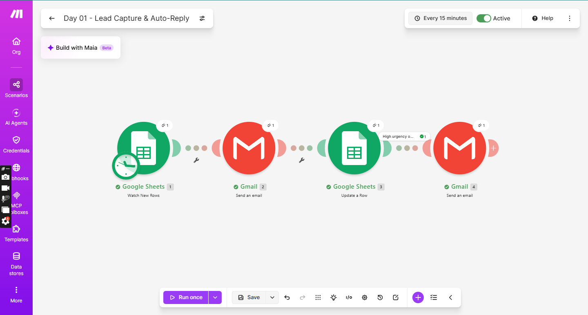
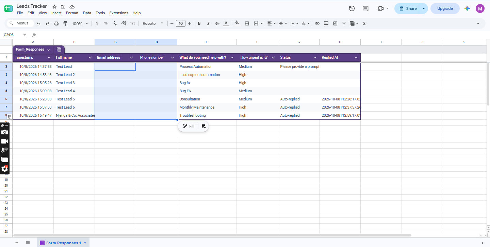
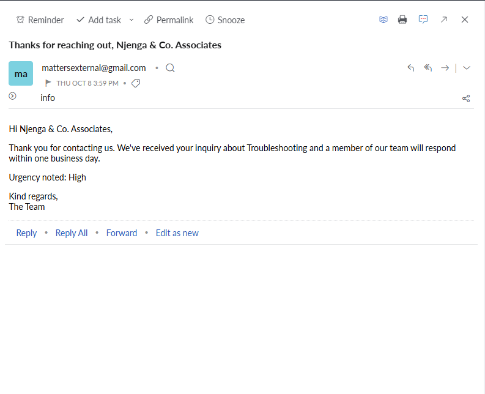

# Day 01: Lead Capture, Auto-Reply and Urgent Alerts

## The problem
Small businesses lose leads when inquiries sit unanswered. Replying
manually is slow, and nothing tells the owner which leads are urgent.

## The solution
A Make.com scenario that runs every 15 minutes. When someone submits
the inquiry form, it:
1. Detects the new row in Google Sheets
2. Sends the lead an instant personalised email reply
3. Marks the lead as "Auto-replied" with a timestamp
4. Emails the owner immediately if the lead marked it as High urgency

## Tools used
Make.com, Google Forms, Google Sheets, Gmail

## Scenario flow

## Result

## What I'd add next
- Reply in the lead's own language
- AI-written replies based on the inquiry
- Slack or WhatsApp alerts for urgent leads

## Setup
Import `lead-capture-autoreply.json` into Make, reconnect your own
Google accounts, and point the modules at your own form and sheet.
