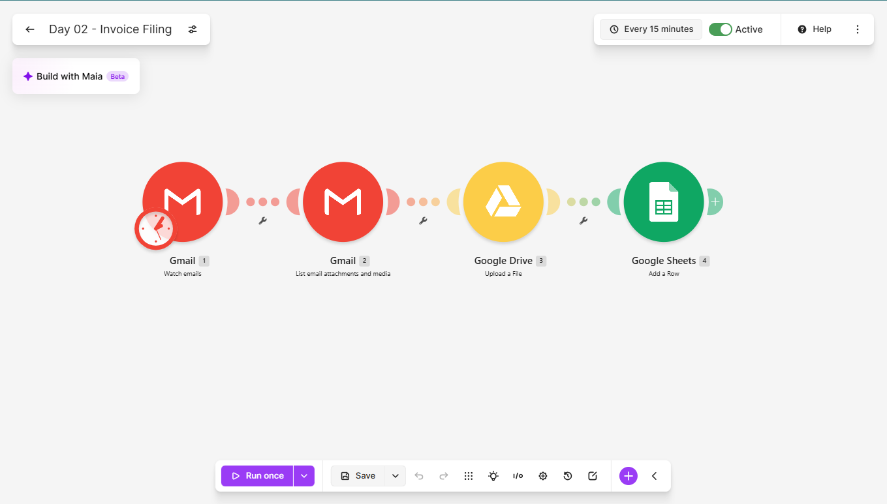
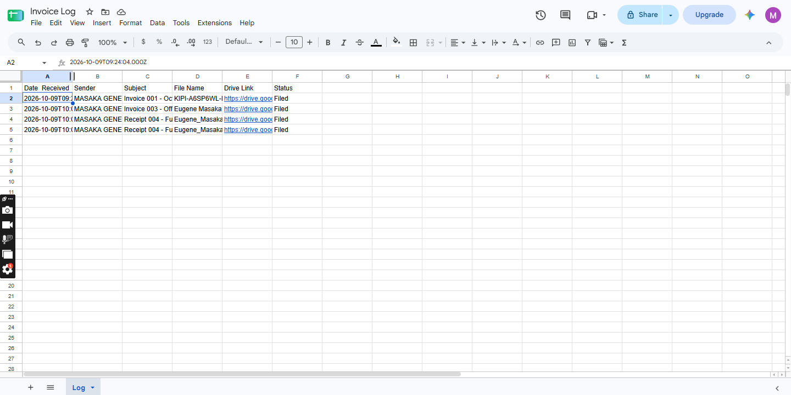
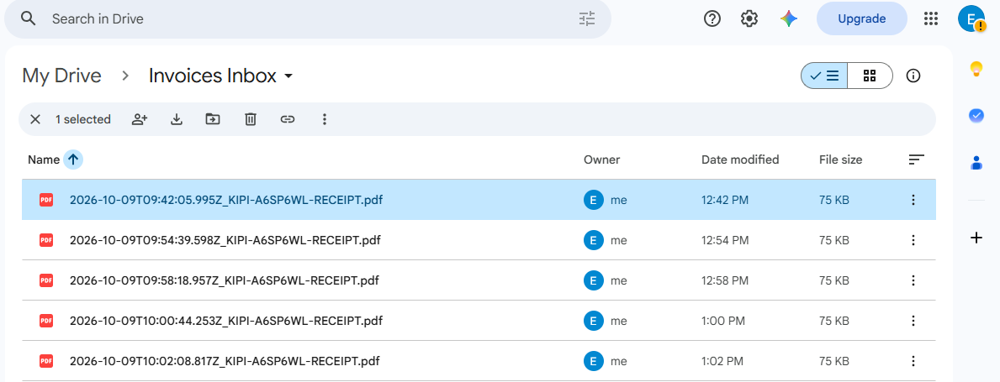

# Day 02: Invoice and Receipt Filing

## The problem
Invoices and receipts arrive buried in email attachments. Finding one
at tax time or during a payment dispute means searching manually, and
files end up scattered across inboxes and downloads folders.

## The solution
A Make.com scenario that runs every 15 minutes. When an email labelled
"Invoices" arrives with attachments, it:
1. Detects the new email in Gmail
2. Extracts every attachment (one email can contain several files)
3. Saves each file into a Google Drive folder
4. Logs sender, subject, file name, date and a Drive link in a sheet

## Tools used
Make.com, Gmail, Google Drive, Google Sheets

## Scenario flow

## Result

## Lessons learned
- Gmail's Watch Emails module doesn't return attachments. A separate
  "List email attachments and media" module outputs one bundle per
  file, so multi-attachment emails are handled automatically.
- Text inside a formatDate() function must be typed without quotation
  marks in Make's mapping panel, or the quotes end up in the output.

## What I'd add next
- AI extraction of the invoice amount, supplier and due date
- Sorting files into folders by month or supplier
- A reminder when an invoice's due date is approaching

## Setup
Import `invoice-filing.json` into Make, reconnect your own Google
accounts, create an "Invoices" label in Gmail with a filter, and point
the modules at your own Drive folder and sheet.
